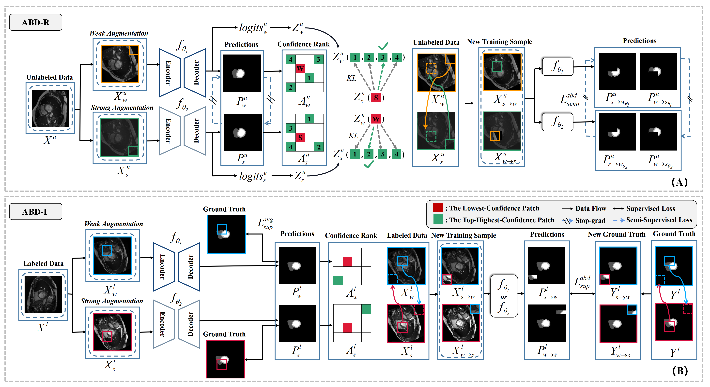

‹center> # Adaptive Bidirectional Displacement for Semi-Supervised Medical Image Segmentation (CVPR 2024) ‹/center>
<b>by Hanyang Chi, Jian Pang, Bingfeng Zhang, and Weifeng Liu.</b>

Consistency learning is a central strategy to tackle unlabeled data in semi-supervised medical image segmentation (SSMIS), which enforces the model to produce consistent
predictions under the perturbation. However, most current approaches solely focus on utilizing a specific single perturbation, which can only cope with limited cases, while
employing multiple perturbations simultaneously is hard to guarantee the quality of consistency learning. In this paper, we propose an Adaptive Bidirectional Displacement (ABD) approach to solve the above challenge.
[paper]() | [code](https://github.com/chyupc/ABD)
## Installation
```bash
git clone https://github.com/chy-upc/ABD.git
```
This repository is based on PyTorch 1.11.0, CUDA 11.3 and Python 3.7.13. All experiments in our paper were conducted on NVIDIA GeForce RTX 3090 GPU with an identical experimental setting.
```
conda create -n ABD python=3.7.13
conda activate ABD
pip install -r requirements.txt
```
## Dataset
Data could be got at [ACDC](https://github.com/HiLab-git/SSL4MIS/tree/master/data/ACDC) and [promise12](https://promise12.grand-challenge.org/Download/).
```
├── ./data
    ├── [ACDC]
        ├── [data]
        ├── test.list
        ├── train_slices.list
        ├── train.list
        └── val.list
    └── [promise12]
        ├── CaseXX_segmentation.mhd
        ├── CaseXX_segmentation.raw
        ├── CaseXX.mhd
        ├── CaseXX.raw
        ├── test.list
        └── val.list
```
## Pretrained Backbone
Download pre-trained [Swin-Unet](https://drive.google.com/drive/folders/1UC3XOoezeum0uck4KBVGa8osahs6rKUY) model to "./code/pretrained_ckpt" folder.
```
├── ./code/pretrained_ckpt
    └── swin_tiny_patch4_window7_224.pth
```
## Usage
To train a model,
```
python ./code/train_ACDC_Cross_Teaching.py  # for ACDC training —— *Ours*-ABD (Cross Teaching) 
python ./code/train_ACDC_BCP.py  # for ACDC training —— *Ours*-ABD (BCP) 
python ./code/train_PROMISE12.py  # for PROMISE12 training
``` 
To test a model,
```
python ./code/test_ACDC.py  # for ACDC testing
python ./code/test_PROMISE12.py  # for PROMISE12 testing
```
## Citation
If you find these projects useful, please consider citing:
```bibtex

```
## Acknowledgements
Our code is largely based on [SSL4MIS](https://github.com/HiLab-git/SSL4MIS), [BCP](https://github.com/DeepMed-Lab-ECNU/BCP), and [SCP-Net](https://arxiv.org/pdf/2305.16214.pdf). Thanks for these authors for their valuable work, hope our work can also contribute to related research.
## Questions
If you have any questions, welcome contact me at 'chihanyang@s.upc.edu.cn'.
